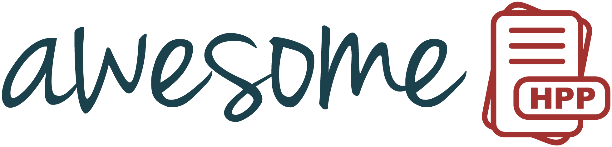

  

  <b>A curated list of awesome header-only C++ libraries</b>

  <a href="https://github.com/sindresorhus/awesome">
    

## Table of Contents

- [Argument Parsers](#argument-parsers)
- [Audio](#audio)
- [Benchmarking](#benchmarking)
- [Communication](#communication)
- [Compression](#compression)
- [Concurrency](#concurrency)
- [Cryptography and Security](#cryptography-and-security)
- [Databases](#databases)
- [Data Formats](#data-formats)
- [Data Mining, Machine Learning, and Deep Learning](#data-mining-machine-learning-and-deep-learning)
- [Data Formatting and Presentation](#data-formatting-and-presentation)
- [Data Querying](#data-querying)
- [Data Structures and Algorithms](#data-structures-and-algorithms)
- [Debugging](#debugging)
- [Deep Learning](#deep-learning)
- [Event Handling Mechanisms](#event-handling-mechanisms)
- [File System](#file-system)
- [Functional Programming](#functional-programming)
- [Geometry, Graphics Processing, and Game Development](#geometry-graphics-processing-and-game-development)
- [GPU](#gpu)
- [Graph](#graph)
- [GUI](#gui)
- [High-performance Computing](#high-performance-computing)
- [HTTP and the Web](#http-and-the-web)
- [Image Processing](#image-processing)
- [Language Bindings](#language-bindings)
- [Logging](#logging)
- [Mathematics](#mathematics)
- [Memory Management](#memory-management)
- [Mocking](#mocking)
- [Networking](#networking)
- [Optimization](#optimization)
- [Parsing Expression Grammars](#parsing-expression-grammars)
- [Portability Definitions](#portability-definitions)
- [Reflection](#reflection)
- [Regular Expression](#regular-expression)
- [Robotics](#robotics)
- [Serialization](#serialization)
- [SIMD](#simd)
- [Standard/Support Libraries](#standardsupport-libraries)
- [State Machine](#state-machine)
- [Statistics](#statistics)
- [String Utilities](#string-utilities)
- [Templating Engines](#templating-engines)
- [Terminal Utilities](#terminal-utilities)
- [Testing Frameworks](#testing-frameworks)
- [Units](#units)
- [Validation](#validation)
- [Web Frameworks](#web-frameworks)

## Argument Parsers

| Library  | Stars |  Description | License |
|--- | ---| ---|--- |
| [Argh!](https://github.com/adishavit/argh)  |  | Argh! A minimalist argument handler.  |  |
| [argparse](https://github.com/p-ranav/argparse) |  | Argument Parser for Modern C++.  |  |
| [args](https://github.com/Taywee/args) |   |  A simple header-only C++ argument parser library.  |  |
| [cmd_line_parser](https://github.com/jermp/cmd_line_parser) |   |  Command line parser for C++17.  |  |
| [CLI11](https://github.com/CLIUtils/CLI11) |  | CLI11 is a command line parser for C++11 and beyond. |  |
| [clipp](https://github.com/muellan/clipp) |  | Powerful & Expressive Argument Parsing for Modern C++. |  |
| [cxxopts](https://github.com/jarro2783/cxxopts) |  | Lightweight C++ GNU style option parser library. |  |
| [fire-hpp](https://github.com/kongaskristjan/fire-hpp) |  | Create fully functional CLIs using function signatures. |  |
| [flags](https://github.com/sailormoon/flags) |  | Simple, extensible, header-only C++17 argument parser. |  |
| [structopt](https://github.com/p-ranav/structopt) |  | Parse command line arguments by defining a struct. |  |

## Audio

| Library  | Stars |  Description | License  |
|--- | ---| ---|--- |
| [minimp3](https://github.com/lieff/minimp3) |  | Minimalistic MP3 decoder single header library. |  |

## Benchmarking

| Library  | Stars |  Description | License  |
|--- | ---| ---|--- |
| [criterion](https://github.com/p-ranav/criterion) |  | Microbenchmarking for Modern C++. |  |
| [nanobench](https://github.com/martinus/nanobench) |  | Simple, fast, accurate microbenchmarking for C++11. |  |
| [picobench](https://github.com/iboB/picobench) |  | A small microbenchmarking library for C++11. |  |

## Communication
| Library  | Stars |  Description | License  |
|--- | ---| ---|--- |
| [comms](https://github.com/commschamp/comms_champion) |  | Implement binary communication protocols in >=C++11. |  |

## Compression

| Library  | Stars |  Description | License  |
|--- | ---| ---|--- |
| [Gzip](https://github.com/mapbox/gzip-hpp) |  | Gzip header-only C++ library. |  |
| [interpolative_coding](https://github.com/jermp/interpolative_coding) |  | Binary Interpolative Coding algorithm. |  |
| [zstr](https://github.com/mateidavid/zstr) |  | A C++ header-only ZLib wrapper. |  |

## Concurrency

| Library  | Stars |  Description | License  |
|--- | ---| ---|--- |
| [cs_libguarded](https://github.com/copperspice/cs_libguarded) |  | Multithreaded programming. |  |
| [mvThreadPool](https://github.com/hoffstadt/mvThreadPool) |  | Simple header-only C++ thread pool library. |  |
| [taskflow](https://github.com/taskflow/taskflow) |  | Modern C++ Parallel Task Programming. |  |
| [task_system](https://github.com/p-ranav/task_system) |  | Better Code: Concurrency - Sean Parent. |  |
| [transwarp](https://github.com/bloomen/transwarp) |  | A header-only C++ library for task concurrency. |  |
| [taskpool](https://github.com/fawdlstty/taskpool) |  | Modern C++ taskpool. |  |

## Cryptography and Security

| Library  | Stars |  Description | License  |
|--- | ---| ---|--- |
| [cppcodec](https://github.com/tplgy/cppcodec) |  | Encode/decode base64, base64url, base32, etc. |  |
| [digestpp](https://github.com/kerukuro/digestpp) |  &nbsp; &nbsp; | C++11 header-only message digest library. |  |
| [PicoSHA2](https://github.com/okdshin/PicoSHA2) |  | Header-file-only, SHA256 hash generator in C++. |  |
| [plusaes](https://github.com/kkAyataka/plusaes) |  | Header only C++ AES cipher library. |  |

## Databases

| Library  | Stars |  Description | License  |
|--- | ---| ---|--- |
| [OTL](http://otl.sourceforge.net/) | | Oracle, ODBC and DB2-CLI Template Library. | OpenBSD |

## Data Formats

| Library  | Stars |  Description | License  |
|--- | ---| ---|--- |
| [bencode](https://github.com/fbdtemme/bencode) |  | C++20 bencode library. |  |
| [Boost.JSON](https://github.com/CPPAlliance/json) |  | JSON parsing, serialization, inspection and modification. |  |
| [cpptoml](https://github.com/skystrife/cpptoml) |  | Header-only library for parsing TOML. |  |
| [csv2](https://github.com/p-ranav/csv2) |  | Fast CSV parser and writer for Modern C++. |  |
| [CSV Parser](https://github.com/vincentlaucsb/csv-parser) |  | Reading, writing, and analyzing CSV files. |  |
| [daw_json_link](https://github.com/beached/daw_json_link) |  | Static JSON parsing in C++. |  |
| [Fast C++ CSV Parser](https://github.com/ben-strasser/fast-cpp-csv-parser) |  | Fast library for reading CSV files. |   |
| [FlatJSON](https://github.com/nixman/flatjson) |  | Extremely fast just one allocation and zero copy JSON parser. |  |
| [inih](https://github.com/jtilly/inih) |  | This is a header only C++ version of inih. |  |
| [nlohmann/json](https://github.com/nlohmann/json) |  | JSON for Modern C++. |  |
| [jsoncons](https://github.com/danielaparker/jsoncons) |  | Construct JSON and JSON-like data formats. |  |
| [minicsv](https://github.com/shaovoon/minicsv) |  | Bare minimal CSV stream based on C++ file streams. |  |
| [picojson](https://github.com/kazuho/picojson) |  | a header-file-only, JSON parser serializer in C++. |  |
| [rapidcsv](https://github.com/d99kris/rapidcsv) |  | C++ CSV parser library. |  |
| [rapidjson](https://github.com/Tencent/rapidjson) |  | A fast JSON parser/generator for C++. |  |
| [rapidxml](https://github.com/dwd/rapidxml) |  &nbsp; &nbsp; &nbsp; &nbsp; &nbsp; | RapidXML fork; XML namespacing, per-element parsing, etc. |  |
| [simdjson](https://github.com/simdjson/simdjson) |  | Parsing gigabytes of JSON per second. |  |
| [simpleini](https://github.com/brofield/simpleini) |  | Read and write INI-style configuration files. |  |
| [taocpp JSON](https://github.com/taocpp/json) |  | C++ header-only JSON library. |  |
| [toml11](https://github.com/ToruNiina/toml11) |  | TOML for Modern C++. |  |
| [tomlplusplus](https://github.com/marzer/tomlplusplus) |   | TOML config file parser and serializer for >=C++17. |  |
| [tortellini](https://github.com/Qix-/tortellini) |  | A really stupid INI file format for C++11. |   |
| [valijson](https://github.com/tristanpenman/valijson) |  | JSON Schema validation. |  |
| [xml2json](https://github.com/Cheedoong/xml2json) |  | A header-only C++ library converts XML to JSON. |  |

## Data Mining, Machine Learning, and Deep Learning

| Library  | Stars |  Description | License  |
|--- | ---| ---|--- |
| [dlib](http://dlib.net/) |  | A toolkit for real-world machine learning and data analysis. |  |
| [frugally deep](https://github.com/Dobiasd/frugally-deep) |  | Use Keras models in C++. |  |
| [hnswlib](https://github.com/nmslib/hnswlib) |  | Fast approximate nearest neighbors. |  |
| [MiniDNN](https://github.com/yixuan/MiniDNN) |  | A header-only C++ library for deep neural networks. |  |
| [nanoflann](https://github.com/jlblancoc/nanoflann) |  | Nearest Neighbor (NN) search with KD-trees. |  |
| [tiny-dnn](https://github.com/tiny-dnn/tiny-dnn) |  | Dependency-free deep learning framework in C++14. |  |

## Data Formatting and Presentation

| Library  | Stars |  Description | License  |
|--- | ---| ---|--- |
| [asap](https://github.com/mobius3/asap) |  | Creating, displaying, iterating and manipulating dates. |  |
| [cxx prettyprint](https://github.com/louisdx/cxx-prettyprint) |  | Pretty-printing of any container in C++(0x). |  |
| [fmt](https://github.com/fmtlib/fmt) |  | A modern formatting library. |  |
| [pprint](https://github.com/p-ranav/pprint) |  | Pretty Printer for Modern C++. |  |
| [strf](https://github.com/robhz786/strf) |  | A fast formatting library for C++14. |  |
| [tabulate](https://github.com/p-ranav/tabulate) |  | Table Maker for Modern C++. |  |

## Data Querying

| Library  | Stars |  Description | License  |
|--- | ---| ---|--- |
| [boolinq](https://github.com/k06a/boolinq) |  | Simplest C++ header-only LINQ template library. |  |

## Data Structures and Algorithms

| Library  | Stars |  Description | License  |
|--- | ---| ---|--- |
| [BitMagic](https://github.com/tlk00/BitMagic) |  | Compressed bit-vectors, logical operations, memory compact containers. |  |
| [concurrent queue](https://github.com/cameron314/concurrentqueue/) |  | Fast multi-producer, multi-consumer lock-free concurrent queue. |   |
| [dynamic bitset](https://github.com/pinam45/dynamic_bitset) |  | The C++17 header-only dynamic bitset. |  |
| [frozen](https://github.com/serge-sans-paille/frozen) |  | Constexpr alternative to gperf for C++14 users. |  |
| [hopscotch map](https://github.com/Tessil/hopscotch-map) |  &nbsp; &nbsp; &nbsp; &nbsp; &nbsp; | Fast hash map and hash set using hopscotch hashing. |  |
| [immer](https://github.com/arximboldi/immer) |  | Postmodern immutable and persistent data structures. |  |
| [MPMCQueue](https://github.com/rigtorp/MPMCQueue) |  | A bounded multi-producer multi-consumer concurrent queue. |  |
| [outcome](https://github.com/ned14/outcome) |  | Lightweight outcome<T> and result<T>. |  |
| [parallel hashmap](https://github.com/greg7mdp/parallel-hashmap) |  | Very fast and memory-friendly hashmap and btree containers. |  |
| [PGM-index](https://github.com/gvinciguerra/PGM-index) |  &nbsp; &nbsp; &nbsp; &nbsp; &nbsp; &nbsp; &nbsp; &nbsp; | Blazing fast queries and updates over billions of items using orders of magnitude less memory than other containers. |  |
| [robin-hood hashing](https://github.com/martinus/robin-hood-hashing) |  | Fast & memory efficient hashtable based on robin hood hashing. |  |
| [robin-map](https://github.com/Tessil/robin-map) |  | Fast hash map and hash set using robin hood hashing. |  |
|[tries](https://github.com/gutjuri/tries) |  | Fast and highly customisable C++20 trie implementation. | [-blue)](https://opensource.org/licenses/GPL-2.0)

## Debugging

| Library  | Stars |  Description | License  |
|--- | ---| ---|--- |
| [backward-cpp](https://github.com/bombela/backward-cpp) |  | A beautiful stack trace pretty printer for C++. |  |

## Deep Learning

| Library  | Stars |  Description | License  |
|--- | ---| ---|--- |
| [ceras](https://github.com/fengwang/ceras) |  | A deep learning engine in C++20. |  |

## Event Handling Mechanisms

| Library  | Stars |  Description | License  |
|--- | ---| ---|--- |
| [eventbus](https://github.com/DeveloperPaul123/eventbus) |  | Mediator pattern event bus for C++. |  |
| [eventpp](https://github.com/wqking/eventpp) |  | Event Dispatcher and callback list for C++. |  |
| [periodic-function](https://github.com/DeveloperPaul123/periodic-function) |  | Callbacks at a specified time interval. |  |

## File System

| Library  | Stars |  Description | License  |
|--- | ---| ---|--- |
| [simplebinstream](https://github.com/shaovoon/simplebinstream) |  | C++ Simplistic Binary Stream. |  |
| [filesystem](https://github.com/gulrak/filesystem) |  | Cross-platform implementation of std::filesystem for C++11/14/17. |  |
| [glob](https://github.com/p-ranav/glob) |  | Glob for C++17. |  |
| [llfio](https://github.com/ned14/llfio) |  | P1031 low-Level file i/o and filesystem library. |  |
| [mio](https://github.com/mandreyel/mio) |  | Cross-platform C++11 memory mapped file IO. |  |
| [mm_file](https://github.com/jermp/mm_file) |  | Memory-mapped files for C++. |  |
| [tinydir](https://github.com/cxong/tinydir) |  &nbsp; &nbsp; &nbsp; | Lightweight, portable C directory and file reader. |  |

## Functional Programming

| Library  | Stars |  Description | License  |
|--- | ---| ---|--- |
| [FunctionalPlus](https://github.com/Dobiasd/FunctionalPlus) |  | Functional Programming Library for C++. |  |
| [immer](https://github.com/arximboldi/immer) |  | Persistent functional data structures in C++. |  |
| [lager](https://github.com/arximboldi/lager) |  | Redux-like unidirectional data-flow for C++. |  |
| [schmutz](https://github.com/arximboldi/schmutz) |  | Easy Guile Scheme C++ bindings. |  |
| [zug](https://github.com/arximboldi/zug) |  | Transducers (from Clojure) in C++. |  |

## Geometry, Graphics Processing, and Game Development

| Library  | Stars |  Description | License  |
|--- | ---| ---|--- |
| [arcball_camera](https://github.com/nlguillemot/arcball_camera) |  | Immediate-mode camera for your graphics demos. |  |
| [cinolib](https://github.com/mlivesu/cinolib) |  | Process polygonal and polyhedral meshes. |  |
| [cr](https://github.com/fungos/cr) |  | A Simple C Hot Reload Header-only Library. |  |
| [CxxSwizzle](https://github.com/gwiazdorrr/CxxSwizzle) |  | Modern C++ swizzling header-only library. |  |
| [earcut.hpp](https://github.com/mapbox/earcut.hpp) |  | Fast Polygon triangulation. |  |
| [entt](https://github.com/skypjack/entt) |  | Entity component system (ECS) and much more. |  |
| [glm](https://github.com/g-truc/glm) |  | OpenGL Mathematics (GLM). |  |
| [librg](https://github.com/zpl-c/librg) |  | 🚀 Making multi-player gamedev simpler since 2017. |  &nbsp; &nbsp; &nbsp; &nbsp; &nbsp; &nbsp; &nbsp; &nbsp; &nbsp; |
| [nanort](https://github.com/lighttransport/nanort) |  | Modern ray tracing kernel. |  |
| [px](https://github.com/pplux/px) |  | Thread Scheduling, Rendering, and so on. |  |
| [Simple OpenGL Loader](https://github.com/tsherif/simple-opengl-loader) |  | Extensible, cross-platform OpenGL loader. |  |
| [Sokol](https://github.com/floooh/sokol) |  | Cross-platform libraries for C and C++. |  |
| [stb](https://github.com/nothings/stb) |  | Single-file public domain libraries. |  |
| [Swarmz](https://github.com/Cultrarius/Swarmz) |  | Swarming (flocking) library for real-time applications. |  |
| [tiny-differentiable-simulator](https://github.com/google-research/tiny-differentiable-simulator) |  &nbsp; &nbsp; &nbsp; &nbsp; &nbsp; &nbsp; &nbsp; | Tiny Differentiable Simulator is a header-only C++ physics library with zero dependencies. |  |
| [tinygltf](https://github.com/syoyo/tinygltf) |  | C++11 tiny glTF 2.0 library. |  |
| [tweeny](https://github.com/mobius3/tweeny) |  | A modern C++ tweening library. |  |
| [Vookoo](https://github.com/andy-thomason/Vookoo) |  | Take the pain out of Vulkan. |  |
| [voxelizer](https://github.com/karimnaaji/voxelizer) |  | Header only mesh voxelizer in c99. | |

## GPU

| Library  | Stars |  Description | License  |
|--- | ---| ---|--- |
| [thrust](https://github.com/thrust/thrust) |  | Parallel programming library. |  &nbsp; &nbsp; &nbsp; &nbsp; &nbsp; &nbsp; &nbsp; &nbsp; &nbsp; &nbsp; &nbsp; |
| [vuda](https://github.com/jgbit/vuda) |  &nbsp; &nbsp; &nbsp; &nbsp; &nbsp; &nbsp; &nbsp; &nbsp; &nbsp; &nbsp; &nbsp; | Vulkan-based library that provides a CUDA Runtime API interface for writing GPU-accelerated applications. |  |

## Graph

| Library  | Stars |  Description | License  |
|--- | ---| ---|--- |
| [CXXGraph](https://github.com/ZigRazor/CXXGraph) |  &nbsp; &nbsp; &nbsp; | Graph Representation and Algorithms Library >= C++17 &nbsp; &nbsp; &nbsp; &nbsp; &nbsp; &nbsp; &nbsp; &nbsp; &nbsp; &nbsp; &nbsp; &nbsp; &nbsp; &nbsp; &nbsp; |  &nbsp; &nbsp; &nbsp; &nbsp; &nbsp; |

## GUI

| Library  | Stars |  Description | License  |
|--- | ---| ---|--- |
| [GuiLite](https://github.com/idea4good/GuiLite) |  | The smallest header-only GUI library(5 KLOC) for all platforms. |  |
| [Nuklear](https://github.com/Immediate-Mode-UI/Nuklear) |  | Immediate mode cross-platform GUI library. |   |
| [WinLamb](https://github.com/rodrigocfd/winlamb) |  | C++11 native Win32 GUI library. |  |

## High-performance Computing

| Library  | Stars |  Description | License  |
|--- | ---| ---|--- |
| [MPL](https://github.com/rabauke/mpl) |  | A C++11 message passing library based on the [Message Passing Interface](https://www.mpi-forum.org/) standard. |  |

## HTTP and the Web

| Library  | Stars |  Description | License  |
|--- | ---| ---|--- |
| [cinatra](https://github.com/qicosmos/cinatra) |  | Modern (c++17), Cross-platform Http Framework. |  |
| [cpp-httplib](https://github.com/yhirose/cpp-httplib) |  | A C++11 Cross platform HTTP/HTTPS library. |  |
| [jwt-cpp](https://github.com/Thalhammer/jwt-cpp) |  | Create and validate JSON web tokens. |  |
| [RESTinio](https://github.com/Stiffstream/restinio) |  | Asynchronous HTTP/WebSocket server C++14 library |  |
| [cuehttp](https://github.com/xcyl/cuehttp) |  | Modern c++ middleware framework for http(http/https)/websocket(ws/wss). |  |

## Image Processing

| Library  | Stars |  Description | License  |
|--- | ---| ---|--- |
| [BitmapPlusPlus](https://github.com/BaderEddineOuaich/BitmapPlusPlus) |  | Simple and Fast header only Bitmap (BMP) library. |  |
| [CImg](https://github.com/dtschump/CImg) |  | Cool Image, one file: full featured image processing. |   |
| [color-util](https://github.com/yuki-koyama/color-util) |  | Colors, Color space converters for RGB, HSL, XYZ, Lab, etc. |  |
| [color](https://github.com/dmilos/color) |  | Color manipulation/conversion for different types and formats. |  |
| [nanopm](https://github.com/unclearness/nanopm) |  | NanoPM, single header only PatchMatch. | |

## Language Bindings

| Library  | Stars |  Description | License  |
|--- | ---| ---|--- |
| [jni.hpp](https://github.com/mapbox/jni.hpp) |  | A modern, type-safe, C++14 wrapper for JNI. |  |
| [pybind11](https://github.com/pybind/pybind11) |  | Seamless operability between C++11 and Python. |  |
| [Selene](https://github.com/jeremyong/Selene) |  | Simple C++11 friendly bindings to Lua. |  |
| [Sol](https://github.com/ThePhD/sol2) |  | Sol3 (sol2 v3.0) - a C++ <-> Lua API wrapper with advanced features and top notch performance. |  |
| [v8pp](https://github.com/pmed/v8pp) |  | Bind C++ functions and classes into V8 JavaScript engine. |  |

## Logging

| Library  | Stars |  Description | License  |
|--- | ---| ---|--- |
| [easyloggingpp](https://github.com/amrayn/easyloggingpp) |  | Single header C++ logging library. |  |
| [plog](https://github.com/SergiusTheBest/plog) |  | Portable, simple and extensible C++ logging library. |  |
| [spdlog](https://github.com/gabime/spdlog) |  | Fast C++ logging library. |  |

## Mathematics

| Library  | Stars |  Description | License  |
|--- | ---| ---|--- |
| [amgcl](https://github.com/ddemidov/amgcl) |  | Solve large sparse linear systems with algebraic multigrid method. |  |
| [dj_fft](https://github.com/jdupuy/dj_fft) |  | FFT library. |   |
| [eigen](https://gitlab.com/libeigen/eigen) | | Template library for linear algebra. |  &nbsp; &nbsp; &nbsp; &nbsp; &nbsp; &nbsp; &nbsp; &nbsp; &nbsp; |
| [exprtk](https://github.com/ArashPartow/exprtk) |  | C++ Mathematical Expression Toolkit. |  |
| [fpm](https://github.com/MikeLankamp/fpm) |  | Fixed-point math library. |  |
| [kfr](https://github.com/kfrlib/kfr) |  | Fast DSP framework, FFT, Sample Rate Conversion, etc. |  |
| [libmorton](https://github.com/Forceflow/libmorton) |  &nbsp; &nbsp; &nbsp; &nbsp; &nbsp; &nbsp; &nbsp; &nbsp; &nbsp; | Methods to efficiently encode/decode Morton codes in/from 2D/3D coordinates. |  |
| [linalg](https://github.com/sgorsten/linalg) |  | Short vector math library for C++. |  |
| [matplotlib-cpp](https://github.com/lava/matplotlib-cpp) |  | C++ plotting library built on the popular matplotlib. |  |
| [matrix](https://github.com/fengwang/matrix) |  | A 2D matrix lib in C++20. |  |
| [NumCpp](https://github.com/dpilger26/NumCpp) |  | C++ implementation of the Python Numpy library. |  |
| [random](https://github.com/effolkronium/random) |  | Random for modern C++ with convenient API. |  |
| [spectra](https://github.com/yixuan/spectra) |  | A header-only C++ library for large scale eigenvalue problems. |  |
| [universal](https://github.com/stillwater-sc/universal) |  | Universal Number Arithmetic. |  |

## Memory Management

| Library  | Stars |  Description | License  |
|--- | ---| ---|--- |
| [ugc](https://github.com/bullno1/ugc) |  | Incremental garbage collector. |  |

## Mocking

| Library  | Stars |  Description | License  |
|--- | ---| ---|--- |
| [FakeIt](https://github.com/eranpeer/FakeIt) |  | C++ mocking made easy. |  |
| [trompeloeil](https://github.com/rollbear/trompeloeil) |  | C++14 mocking framework. |  |

## Networking

| Library  | Stars |  Description | License  |
|--- | ---| ---|--- |
| [asio](https://github.com/chriskohlhoff/asio) |  | Asio C++ Library. | |
| [brynet](https://github.com/IronsDu/brynet) |  | Cross-platform C++ TCP network library. |  |
| [cppzmq](https://github.com/zeromq/cppzmq) |  | Header-only C++ binding for libzmq. |  |
| [nygma](https://github.com/stackless-goto/nygma) |  | Network packet processing and indexing. |  |
| [uvw](https://github.com/skypjack/uvw) |  | libuv wrapper in modern C++. |  |

## Optimization

| Library  | Stars |  Description | License  |
|--- | ---| ---|--- |
| [ensmallen](https://github.com/mlpack/ensmallen) |  | C++ library for numerical optimization. |  |

## Parsing Expression Grammars

| Library  | Stars |  Description | License  |
|--- | ---| ---|--- |
| [cpp-peglib](https://github.com/yhirose/cpp-peglib) |  | PEG (Parsing Expression Grammars) library. |  |
| [PEGTL](https://github.com/taocpp/PEGTL) |  | Parsing Expression Grammar Template Library. |  |

## Portability Definitions

| Library  | Stars |  Description | License  |
|--- | ---| ---|--- |
| [hedley](https://github.com/nemequ/hedley) |  | Move #ifdefs out of your code. |  |

## Reflection

| Library  | Stars |  Description | License  |
|--- | ---| ---|--- |
| [better-enums](https://github.com/aantron/better-enums) |  | C++ compile-time enum to string, iteration. |  |
| [magic_enum](https://github.com/Neargye/magic_enum) |  | Static reflection for enums. |  |
| [meta](https://github.com/skypjack/meta) |  | Macro-free runtime reflection system. |  |
| [nameof](https://github.com/Neargye/nameof) |  | Nameof operator for modern C++. |  |
| [refl-cpp](https://github.com/veselink1/refl-cpp) |  | Compile-time reflection library. |  |
| [visit_struct](https://github.com/garbageslam/visit_struct) |  | A miniature library for struct-field reflection. |  |

## Regular Expression

| Library  | Stars |  Description | License  |
|--- | ---| ---|--- |
| [compile-time regular expressions](https://github.com/hanickadot/compile-time-regular-expressions) |  &nbsp; &nbsp; &nbsp; &nbsp; | A Compile time regular expression matcher. |  |

## Robotics

| Library  | Stars |  Description | License  |
|--- | ---| ---|--- |
| [manif](https://github.com/artivis/manif) |  | Small library for Lie theory. |  |

## Serialization

| Library  | Stars |  Description | License  |
|--- | ---| ---|--- |
| [cereal](https://github.com/USCiLab/cereal) |  | A C++11 library for serialization. |  |
| [essentials](https://github.com/jermp/essentials) |  | Transparent serialization/deserialization. |  |
| [fuser](https://github.com/Xeverous/fuser) |  | Automatic (de)serialization of C++ types to/from JSON. |  |
| [YAS](https://github.com/nixman/yas) |  | A C++11 (de)serialization library with support for binary/text/json archives. |  |

## SIMD

| Library  | Stars |  Description | License  |
|--- | ---| ---|--- |
| [libsimdpp](https://github.com/p12tic/libsimdpp) |  | Low-level SIMD library. |  |
| [simde](https://github.com/simd-everywhere/simde) |  | Implementations of SIMD instruction sets. |  |
| [tsimd](https://github.com/ospray/tsimd) |  | Fundamental C++ SIMD types for Intel CPUs. |  |

## Standard/Support Libraries

| Library  | Stars |  Description | License  |
|--- | ---| ---|--- |
| [bitflags](https://github.com/m-peko/bitflags) |  | Easily managing set of flags. |  |
| [cpp-typelist](https://github.com/dave-hagedorn/cpp-typelist) |  | Modern typelist for C++20 |  |
| [expected](https://github.com/TartanLlama/expected) |  | C++11/14/17 std::expected. |  |
| [expected-lite](https://github.com/martinmoene/expected-lite) |  | Expected objects in C++11 and later. |  |
| [gsl](https://github.com/microsoft/GSL) |  | ISO C++ Guidelines Support Library (GSL) by Microsoft. |  |
| [gsl-lite](https://github.com/gsl-lite/gsl-lite) |  | ISO C++ Guidelines Support Library (GSL). |  |
| [hana](https://github.com/boostorg/hana) |  | Your standard library for metaprogramming. |  |
| [itlib](https://github.com/iboB/itlib) |  | Standard-library-like containers and extensions. |  |
| [leaf](https://github.com/boostorg/leaf) |  | Lightweight Error Augmentation Framework. |  |
| [libunifex](https://github.com/facebookexperimental/libunifex) |  | Unified Executors |  |
| [mp11](https://github.com/boostorg/mp11) |  | C++11 metaprogramming library. |  |
| [NanoRange](https://github.com/tcbrindle/NanoRange) |  | Range-based goodness for C++17. |  |
| [numeric_ranges](https://github.com/tcbrindle/numeric_ranges) |  | Numeric algorithms for C++20 Ranges. |  |
| [optional](https://github.com/TartanLlama/optional) |  | C++11/14/17 std::optional. |  |
| [optional-lite](https://github.com/martinmoene/optional-lite) |  | A C++17-like optional for C++98/11 and later. |  |
| [range-v3](https://github.com/ericniebler/range-v3) |  | Range library for C++14/17/20. |  |
| [rangesnext](https://github.com/cor3ntin/rangesnext) |  | Tanges features for c+23 ported to C++20. |  |
| [span-lite](https://github.com/martinmoene/span-lite) |  | A C++20-like span for C++98/11 and later. |  |
| [string-view-lite](https://github.com/martinmoene/string-view-lite) |  | A C++17-like string_view for C++98/11 and later. |  |
| [uberswitch](https://github.com/falemagn/uberswitch) |  | Alternative to the C++ switch statement. |  |
| [variant-lite](https://github.com/martinmoene/variant-lite) |  | A C++17-like variant for C++98/11 and later. |  |
| [Windows Implementation Libraries (WIL)](https://github.com/microsoft/wil) |  &nbsp; &nbsp; &nbsp; &nbsp; &nbsp; &nbsp; &nbsp; &nbsp; | Readable type-safe C++ interfaces for common Windows coding patterns. |   &nbsp; &nbsp; &nbsp; &nbsp; &nbsp; &nbsp; &nbsp; &nbsp; |

## State Machine

| Library  | Stars |  Description | License  |
|--- | ---| ---|--- |
| [hfsm2](https://github.com/andrew-gresyk/HFSM2) |  | High-performance hierarchical finite state machine framework. |  |
| [hsm](https://github.com/erikzenker/hsm) |  | Finite state machine library based on the boost hana. |  |
| [tinyfsm](https://github.com/digint/tinyfsm) |  | A simple C++ finite state machine library. |  |
| [SMLite](https://github.com/fawdlstty/SMLite) |  | State machine library for C, C++, C#, Java, JavaScript, Python, `VB.Net`. |  |
| [cuestate](https://github.com/xcyl/cuestate) |  | C++ template metaprogramming FSM. |  |

## Statistics

| Library  | Stars |  Description | License  |
|--- | ---| ---|--- |
| [histogram](https://github.com/boostorg/histogram) |  | Multi-dimensional generalized histograms. |  |
| [kalman](https://github.com/mherb/kalman) |  | Kalman Filtering Library (EKF, UKF) based on Eigen3. |  |
| [stats](https://github.com/kthohr/stats) |  | Statistical distribution functions. |  |

## String Utilities

| Library  | Stars |  Description | License  |
|--- | ---| ---|--- |
| [utf-cpp](https://github.com/ww898/utf-cpp) |  | UTF-8/16/32 for Windows/Linux/MacOs. |  |
| [wildcards](https://github.com/zemasoft/wildcards) |  | String matching using wildcards. |  |

## Templating Engines

| Library  | Stars |  Description | License  |
|--- | ---| ---|--- |
| [inja](https://github.com/pantor/inja) |  | A Template Engine for Modern C++. |  |

## Terminal Utilities

| Library  | Stars |  Description | License  |
|--- | ---| ---|--- |
| [indicators](https://github.com/p-ranav/indicators) |  | Activity Indicators for Modern C++. |  |
| [rang](https://github.com/agauniyal/rang) |  | A Minimal library for terminal goodies 💄✨. |  |
| [termcolor](https://github.com/ikalnytskyi/termcolor) |  | Print colored messages to the terminal. |  |

## Testing Frameworks

| Library  | Stars |  Description | License  |
|--- | ---| ---|--- |
| [ApprovalTests.cpp](https://github.com/approvals/ApprovalTests.cpp) |  | Native ApprovalTests for C++. |  |
| [Catch2](https://github.com/catchorg/Catch2) |  | Test framework for unit-tests, TDD and BDD. |  |
| [doctest](https://github.com/onqtam/doctest) |  | The fastest feature-rich C++11/14/17/20 testing framework. |  |
| [iutest](https://github.com/srz-zumix/iutest) |  | Test framework for unit-tests. |  |
| [lest](https://github.com/martinmoene/lest) |  | Tiny framework for unit-tests, TDD and BDD. |  |
| [ut](https://github.com/boost-ext/ut) |  | UT: C++20 μ(micro)/Unit Testing Framework. |  |

## Units

| Library  | Stars |  Description | License  |
|--- | ---| ---|--- |
| [mpusz/units](https://github.com/mpusz/units) |  | Compile-time dimensional analysis and unit/quantity manipulation. |  |
| [nholthaus/units](https://github.com/nholthaus/units) |  | Dimensional analysis and unit conversion library. |  |
| [SI](https://github.com/bernedom/SI) |  | Type safety and user defined literals for physical units. |  |

## Validation

| Library  | Stars |  Description | License  |
|--- | ---| ---|--- |
| [cpp-validator](https://github.com/evgeniums/cpp-validator) |  | C++ library for data validation. |  |

## Web Frameworks

| Library  | Stars |  Description | License  |
|--- | ---| ---|--- |
| [crow](https://github.com/ipkn/crow) |  | Micro web framework inspired by Python Flask. |  |
